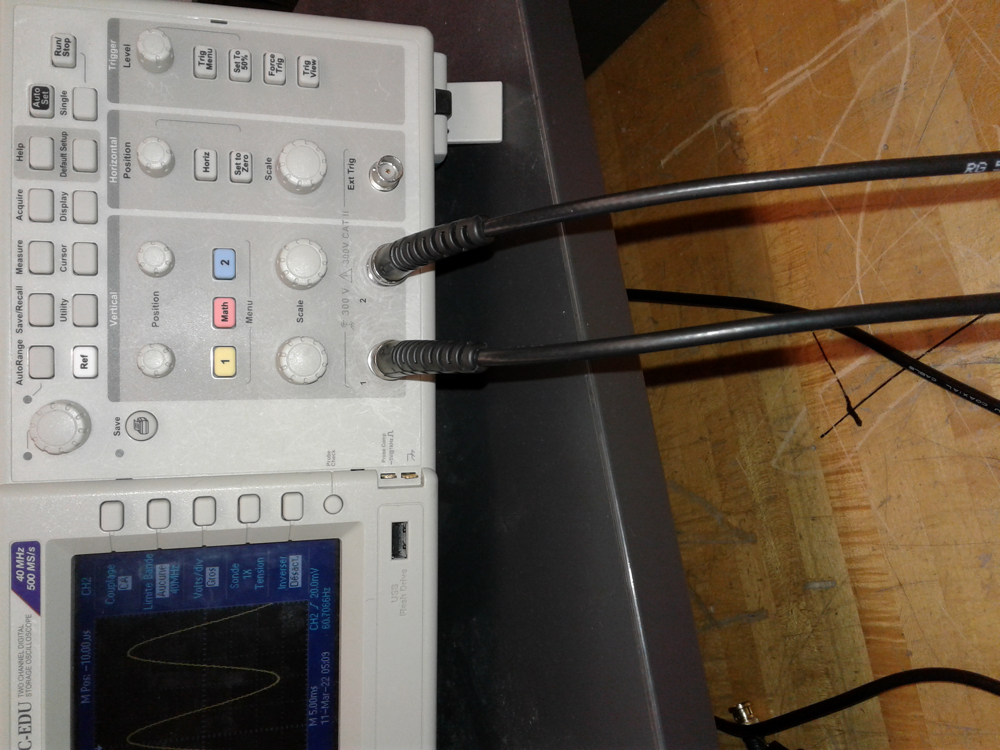
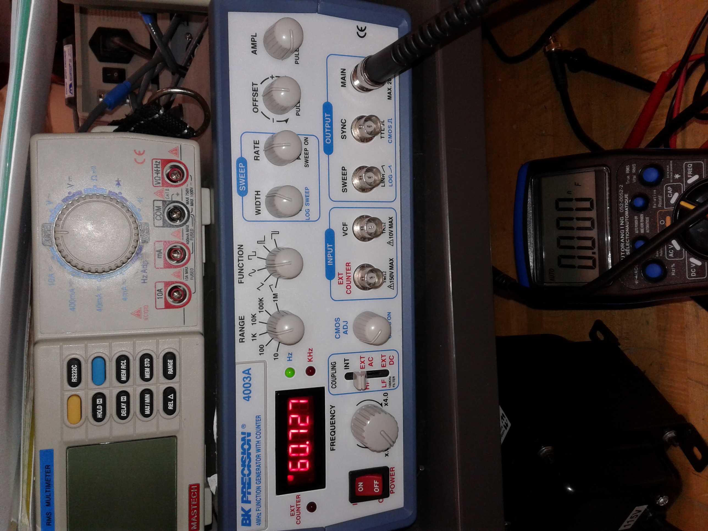
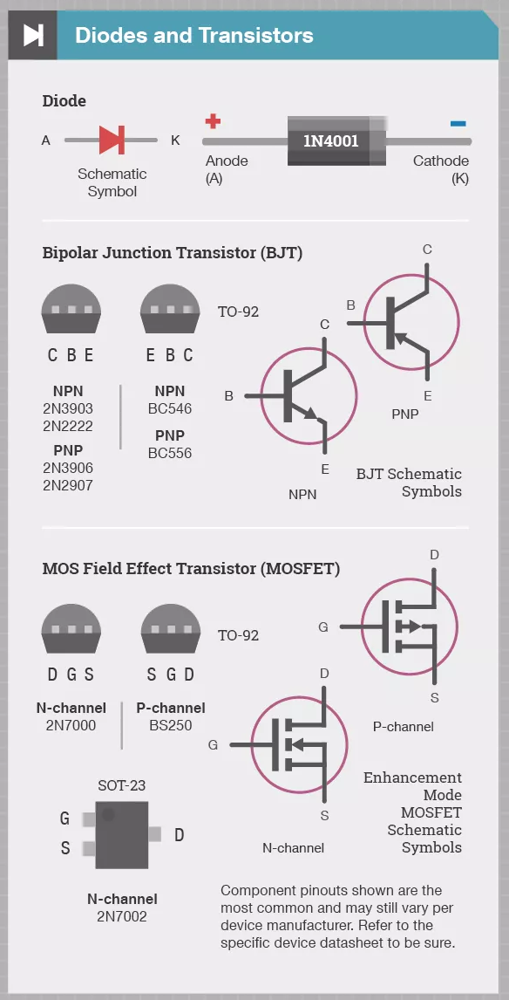
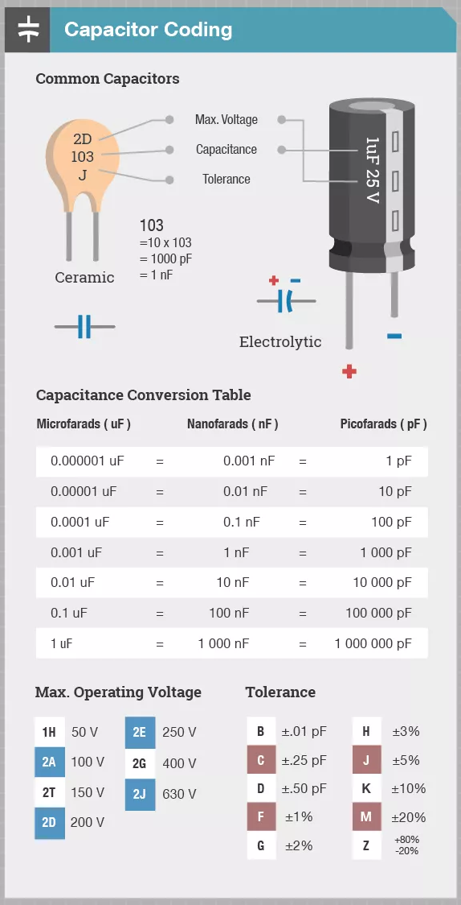
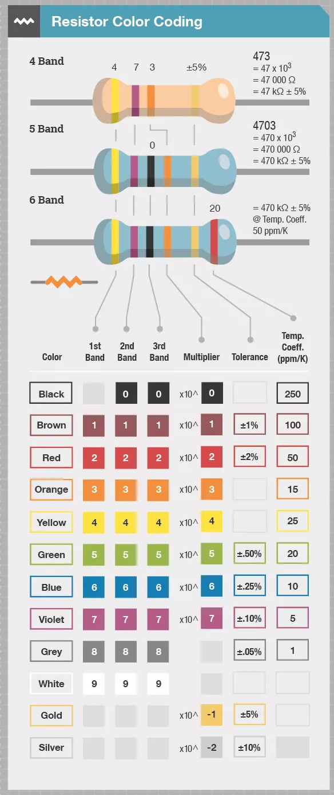
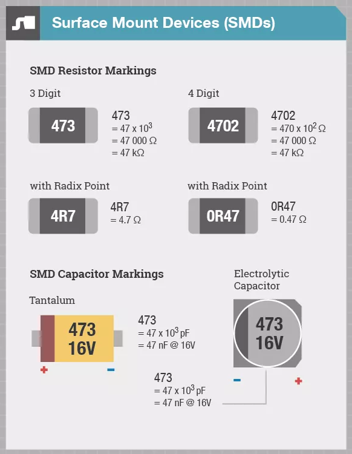
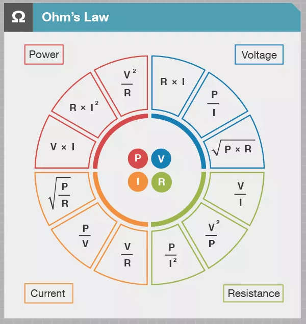
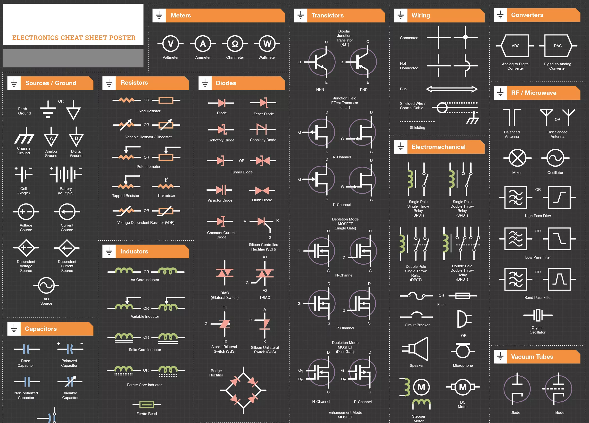
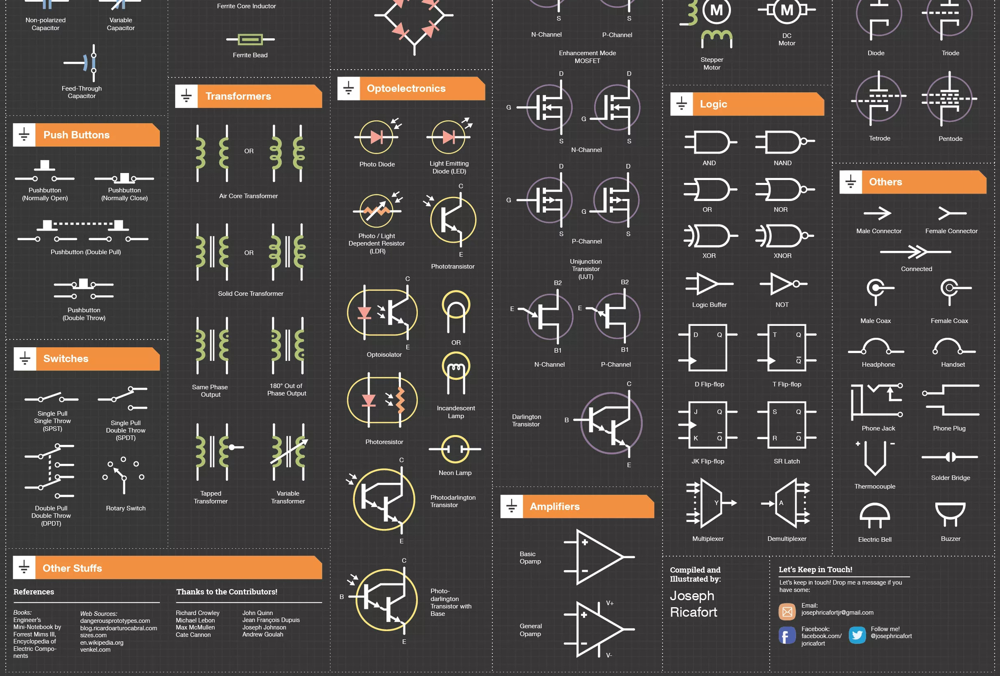

# Electronics, Sensors, and Actuators with C on Arduino

Electronics, sensors, and actuators with C on Arduino

Instruments: bench DC power supply, bench function generator, bench and portable multimeters, bench oscilloscope

Tools: pincers, cutters, soldering station, extraction tools, cable stripper, crimpers, screwdrivers, and more 

Components: breadboards, connecting wires, crocrodile clips, banana terminals, coaxial cables, resistors, SIP resistors, capacitors, coils, LEDs (unicolor, bicolor, RGB), barographs, push buttons (on-off, off-on), pull-up and pull-down resistors, DC motor, step motor, servo motor (90, 180, 360), transitors, diodes, potentiometers, RGB LCD shields, photoresistors, temperature and humidity sensor, relays, switches, dual flip-flop, and more

Software: Arduino IDE with C sketches to command and analyze incoming data, Multisim to simulate and measure circuits

Protocols: analog (8-bit out, 10-bit in) and digital GPIO, serial or UART (RX, TX), I2C (SCL, SDA), SPI (SCK, MSO, MOSI, SS), WiFi, Bluetooth and BLE, LoRa

|   |   |   |
|---|---|---|
| bench instruments  |   |   |
| RC circuit; phase shift, power pin vs resistor pins measurements with a capacitor  |   |   |
| RL circuit; measurements with a resistor and a coil  |   |   |

|   |   |   |   |
|---|---|---|---|
|   |   |   |   |
|   |   |   |   |
