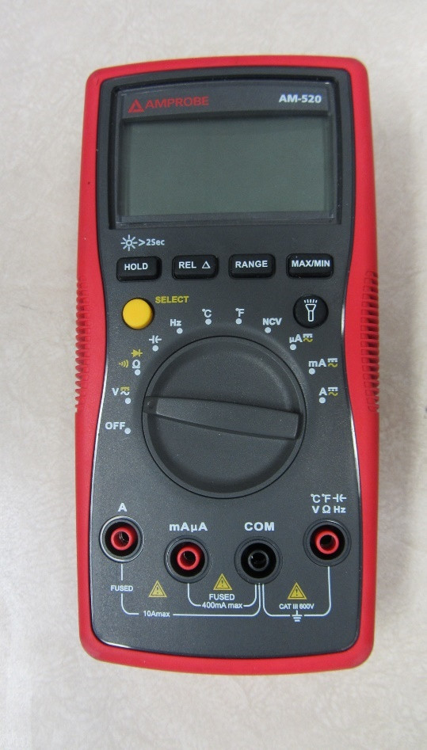

# Électronique, capteurs et actionneurs en langage C sur Arduino

**Objectif:** maitriser les fondements de l'électronique (concepts d'électricité, composants, vocabulaire), des microcontrôleurs (Arduino Uno), du langage C afin de construire des projets simples en IoT et de pouvoir collaborer avec des spécialistes de ces domaines dans des projets avancés.

Projets, expériences (consulter le **projet intégrateur**, par exemple, avec ses composants, un Arduino Uno, un code source C, un diagramme, etc.). Les projets et les expériences impliquent:

- Outils: pinces, brucelles, cutters, ciseaux, station de soudure, outils d’extraction, dégaineur automatique ou pince à dénuder, tournevis, et plus
- Instruments: alimentation DC de table, générateur de fonction, multimètres portable et de table, oscilloscope de table

| Échantillons  |   |   |
|:---|:---|:---|
| Alimentation ; Générateur de fonctions  |   |   |
| Multimètres |   |   |
| Oscilloscope ; Générateur de fonctions  |   |   |
| Circuit RC: déphasage entre bornes alimentation et bornes résistance |   |   |
| Circuit RL: mesures aux bornes résistances et bornes bombine |   |   |

| Échantillons  |   |   |   |
|:---|:---|:---|:---|
|   |   |   |   |
|   |   |   |   |

- Composants: plaquette ou platine de montage, fils de connexion, pinces crocodile, connecteurs banane,  câbles coaxiaux, résistances, résistances SIP, condensateurs, bobines, DELs (unicolore, bicolore, RGB), barographes, boutons (on-off, off-on), résistances pour rappels haut et bas, moteur DC, moteur step, servomoteurs (90°, 180°, 360°), transistors, diodes, potentiomètres, cartes LCD RGB, photorésistances, capteurs environnementaux (température, humidité, etc.), relais, interrupteurs, bascules (*flip-flop*), et plus
- Protocoles: broches GPIO analogiques (8-bit ou 0-255 en sortie, 10-bit ou 0-1023 en entrée) et numériques (0-1), PWM, SPW, broches en série ou UART (RX, TX), broches I2C (SCL, SDA), broche SPI (SCK, MSO, MOSI, SS), antennes WiFi, Bluetooth et BLE, LoRa

| Échantillons  |   |   |
|:---|:---|:---|
| Montages: 2 rappels hauts ; rappel haut et rappel bas  |   |   |
| Montage: afficheur  |   |   |
| Schémas: relai ; servomoteur  |   |   |
| Schéma Fritzing: moteur DC  |   |   |

- Logiciels: EDI Arduino, codes sources C pour piloter le microcontrôleur (et le montage de composants) et analyser les données entrantes, Multisim pour simuler et mesurer un circuit

| Échantillons  |   |
|:---|:---|
| Multisim: circuit, simulation et mesure  |   |
